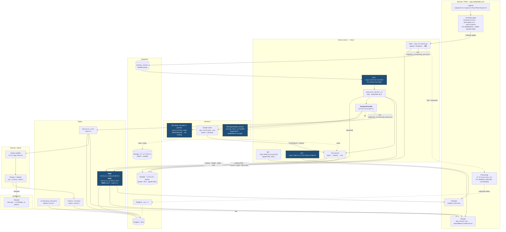

# AI foot image analysis — integration architecture

Status: proposal. Scope: `soleiq-web` (app.soleiqhealth.com) plus the sibling
`soleiq-foot-ai` training/serving repo.

## 1. Summary of the recommended approach

**You are not building this from scratch.** Three of the four pieces already
exist in this codebase and are not connected to each other:

1. `server/providers/analysis.ts` defines an `AnalysisProvider` interface, and
   `server/workers/analysis-worker.ts` already consumes it through an outbox
   queue with retries, dead-lettering, and one atomic persistence RPC. **This
   is the seam.** Every model integration below plugs in here and nothing else
   in the request path has to change.
2. `lib/wound/` is a complete, tested, deliberately melanin-invariant
   measurement library (960 lines: skin segmentation, connected components,
   hole filling, px→mm scale, tissue classification, visit-over-visit
   `compareWound`). It runs **only in the browser**, on the device-local path,
   and **its results are never persisted.**
3. `soleiq-foot-ai/` is a real PyTorch/timm training harness with
   patient-disjoint 5-fold CV, recall-targeted threshold tuning, calibration
   (ECE), Grad-CAM, a FAISS similarity index, and ONNX export. Its `config.yaml`
   already carries `capabilities.segmentation: { enabled: false }` — a flag
   waiting for exactly this work.

The missing fourth piece is a trained model on real data, and the wiring
between the three.

**Recommended MVP (Phase 1): classification + weak localization, with
*classical* segmentation for the boundary — and no new services.**

- Export the foot-ai classifier to ONNX and run it with `onnxruntime-node`
  **inside the existing analysis worker**. No Python service, no new infra.
- Keep the Claude vision call as the localization + narrative layer. It already
  emits `findings[].region` normalized boxes, and `measureUlcerInRegion` already
  consumes exactly that shape.
- Move the `lib/wound` measurement out of the browser into the worker and
  persist it to a new `analysis_measurements` table.
- Trace the segmented mask to a polygon. `components/result/ResultOverlay.tsx`
  already renders `DetectionRegion.polygon` as SVG — the renderer exists, it
  just has no producer.
- Make the flow non-blocking with Supabase Realtime on
  `screening_sessions.status`. `wss://*.supabase.co` is already allowed by the
  CSP in `next.config.js`.

That single phase delivers detection (box), classification, a lesion boundary,
blue contour + red length + green width in millimetres, and visit-over-visit
comparison — without standing up a single new service.

**Phase 2** replaces the classical mask with a learned one: DeepLabV3+ / U-Net
with a **MobileNetV2 encoder**. That is where MobileNetV2 genuinely belongs.
**Phase 3** is production hardening: a real worker, a model registry,
shadow/canary promotion, Fitzpatrick-stratified fairness gates, BAAs, and
prospective clinical validation.

---

## 2. Where this lives in the current architecture

### 2.1 What exists today

The app is a Next.js 15 App Router + Supabase modular monolith on Vercel, with
two analysis paths that have diverged:

**Path A — canonical / hospital (persisted, async-capable):**

```
POST /api/screenings
  → server/screenings.ts :: createCanonicalScreening()
      → upload 4 photos to `clinical-media` bucket (caller's session, storage RLS)
      → insert media_assets rows
      → rpc enqueue_screening_analysis()      -- validates the canonical 4, status→analyzing,
                                                 inserts outbox_events('analysis_requested')
      → processAnalysisEvent() INLINE, best-effort, under withDeadline()
      → sweepPendingAnalyses() for the backlog
  → server/workers/analysis-worker.ts :: processAnalysisEvent(eventId, provider)
      → download private media (service role)
      → provider.analyze()                     -- AnalysisProvider — THE SEAM
      → PhotoScreeningSchema.parse + enforceScreeningSafety()
      → rpc complete_screening_analysis()      -- service_role only, atomic:
                                                  analysis_runs + reports + outbox event
      → report_recommendations upsert (best-effort)
```

**Path B — device-local / patient flow (not persisted):**

```
components/screens/17-Processing.tsx
  → lib/analyzeFootPhotos.ts :: analyzeFootPhotos()
      → lib/captureGate.ts     — refuses to analyze bad captures
      → POST /api/foot-analysis — Claude vision, structured JSON schema out
      → lib/wound :: measureUlcerInRegion()   -- IN THE BROWSER, RESULT DISCARDED
      → store.setResult()
```

Path B is where the measurement intelligence lives. Path A is where the
persistence, tenancy, audit, and review live. **The core structural
recommendation is to collapse B into A**: the measurement belongs in the worker,
next to the model that produced the box.

### 2.2 The schema is already ML-ready

This is the strongest thing about the existing design and it should be
preserved, not replaced. `analysis_runs` already records full provenance:

| Column | Why it matters for ML |
| --- | --- |
| `model_provider`, `model_name`, `model_version` | Answers "which model produced this report" — required for recall |
| `prompt_version`, `schema_version`, `safety_rules_version` | Independent versioning of the non-model layers |
| `input_asset_ids uuid[]` | Exact inputs, for reproducing a run |
| `structured_output jsonb` | The post-safety payload |
| `idempotency_key` unique per session | Re-running the worker cannot double-write |

`media_assets.asset_type` already permits `'derived'`, so rendered overlay
images have a home with no schema change. `media_assets.capture_quality jsonb`
already has a home for preprocessing metadata.

### 2.3 Where the new code attaches

The AI workflow should live **behind `AnalysisProvider`, invoked only by the
worker, never by the browser.** Concretely:

- A new `CompositeAnalysisProvider` implements `AnalysisProvider` and fans out to
  (a) the ONNX classifier, (b) the Claude vision call, then merges into one
  `PhotoScreeningResult`.
- The worker gains a second, non-fatal step after `complete_screening_analysis`:
  measure each wound-like finding, persist to `analysis_measurements`, and write
  a derived overlay asset.
- Nothing in `app/`, `components/`, or the RLS policies needs to know which
  model ran.

---

## 3. Architecture diagram



---

## 4. Model recommendations

### 4.1 Classification, detection, or segmentation first?

**Classification + weak localization first. Learned segmentation last.**

The ordering is forced by annotation cost, not by model difficulty:

| Task | Label needed | Cost per image | Where you are |
| --- | --- | --- | --- |
| Classification | one class per image | seconds | harness built, <100 real images |
| Detection | bounding box | ~30 s | Claude already emits boxes for free |
| Segmentation | pixel mask | 3–10 min, clinician-grade | no masks at all |

You can ship a boundary trace **today** without a segmentation model, because
`lib/wound/segment.ts` already does classical region growing inside a box using
robust statistics against the patient's own surrounding skin. It produces a
mask; a mask has a boundary; a boundary is a polygon; `ResultOverlay` already
draws polygons. The learned model improves that boundary later without changing
anything downstream of the mask.

### 4.2 Is MobileNetV2 the right baseline?

**Split the answer by role. It is right for two of the three, and wrong for the
one you would have used it for.**

**Server-side classifier — keep EfficientNet-B0, do not switch.**
The foot-ai README is explicit: *"The model itself never ships to the device."*
Inference is server-side, so MobileNetV2's efficiency advantage buys nothing and
costs accuracy:

| | Params | GFLOPs | ImageNet top-1 |
| --- | --- | --- | --- |
| MobileNetV2 (1.0×) | ~3.5 M | ~0.31 | ~72.0 % |
| EfficientNet-B0 | ~5.3 M | ~0.39 | ~77.7 % |

Both are mobile-class. B0 is strictly better at essentially the same server cost.

**But make it a measurement, not a decree.** `FootAIModel` calls
`timm.create_model(backbone, num_classes=0, global_pool="avg")` and reads
`num_features` dynamically, so switching backbones is a **one-line config
change** — `model.backbone: mobilenetv2_100` in `config.yaml`, zero code edits.
Run both through the existing patient-disjoint 5-fold harness on the same splits
and pick by measured sensitivity at fixed specificity. That is an afternoon.

**Segmentation encoder — MobileNetV2 is the right choice.** DeepLabV3+ with a
MobileNetV2 encoder is the canonical mobile segmentation pairing. It exports to
ONNX cleanly, and its plain ReLU6 + depthwise separable convolutions quantize to
INT8 far better than EfficientNet's squeeze-excite blocks and SiLU activations
— which matters the moment segmentation moves toward a device or a live preview.

**On-device capture gate — MobileNetV2 (or MobileNetV3-Small) is the highest-value
on-device use.** `lib/footDetection.ts` currently hand-rolls Otsu thresholding
and variance-of-Laplacian in JS to answer "is this a foot, in frame, sharp." A
tiny MobileNetV2 in ONNX Runtime Web would answer that far better at video rate,
never touching the network, and would cut the retake rate — which is the single
biggest latency and cost lever in the whole system. **This is a different model
from the diagnostic one** and should be versioned separately.

### 4.3 U-Net or DeepLabV3+?

**Start with U-Net + MobileNetV2 encoder; graduate to DeepLabV3+ around ~1500
masks.** With `segmentation_models_pytorch` both are one line, so this is a
config choice, not a rewrite.

- **U-Net** is more forgiving with small datasets, trains faster, and is
  well-matched to a single foreground class.
- **DeepLabV3+** wins on boundary quality — ASPP gives multi-scale context and
  the decoder fuses low-level features back in. That matters here specifically
  because the deliverable *is* a boundary and a millimetre number.

Evaluate both on **boundary** metrics, not just Dice. Dice is largely
insensitive to exactly the few-pixel boundary error that ruins a measurement.

### 4.4 On-device vs server-side inference

**Server-side for anything clinical.** Three reasons specific to this codebase:

1. `analysis_runs` pins `model_version` to every report. On-device inference
   means uncontrolled model versions across app installs — you could not answer
   "which model produced this report," and you could not recall a bad model.
2. `complete_screening_analysis` raises unless `auth.role() = 'service_role'`.
   The design already refuses to let a client write clinical results, correctly.
3. `enforceScreeningSafety()` — the urgent-finding escalation and the
   discourages-care filter — must run somewhere a user cannot bypass.

**On-device for capture gating only.** Quality, foot presence, framing, surface.
That code already exists client-side and should stay there.

---

## 5. End-to-end flows

### 5.1 Image upload

Unchanged from today, with one behavioural fix:

1. `lib/photoQuality.ts` decodes any format the browser can read and draws it
   down to `MAX_EDGE` on a canvas. **Side benefit worth noting: the canvas
   re-encode strips EXIF**, so GPS and device metadata never reach the server.
2. `lib/captureGate.ts` refuses to submit an unusable set.
3. `POST /api/screenings` uploads under the **caller's** session so storage RLS
   applies, inserts `media_assets`, calls `enqueue_screening_analysis`.
4. **Change:** return `202 { sessionId }` immediately. Stop awaiting analysis.

### 5.2 Preprocessing pipeline

| Stage | Where | Note |
| --- | --- | --- |
| Decode, downscale to MAX_EDGE, strip EXIF | client, `photoQuality.ts` | exists |
| Brightness / blur / silhouette / geometry gate | client, `footDetection.ts` | exists |
| Canonical-set completeness | `enqueue_screening_analysis` | exists, DB-enforced |
| Resize 224×224, ImageNet normalize, center crop | **worker, new** | must exactly match `build_eval_transform` in foot-ai — a mismatch here is the single most common silent accuracy loss |
| Foot mask + robust skin reference | `lib/wound/segment.ts` | exists |
| px→mm scale | `lib/wound/scale.ts` | exists, but see §5.6 |

Pin the eval transform in **one** place. Export the exact preprocessing
constants from foot-ai into a JSON blob published alongside the ONNX file, and
read them in the worker. Do not retype them.

### 5.3 Model inference flow

```
worker
  ├─ ONNX classifier (per image, 4 images)      ~60 ms each, CPU
  │    → raw logits → softmax → analysis_predictions (PRE-threshold)
  │    → threshold from model_registry.threshold → decision
  ├─ Claude vision (all 4 images, one call)     ~5–15 s
  │    → PhotoScreeningResult incl. findings[].region
  └─ merge → CompositeAnalysisProvider result
       → PhotoScreeningSchema.parse → enforceScreeningSafety
       → rpc complete_screening_analysis
  then, non-fatally:
       → for each wound-like finding: lib/wound measure → analysis_measurements
       → render overlay → media_assets(asset_type='derived')
```

**Store raw scores before thresholding.** `analysis_runs.structured_output`
holds the post-safety narrative only. `analysis_predictions` holding raw
probabilities lets you re-threshold retroactively without re-running inference,
and is what calibration-drift monitoring reads.

**Disagreement policy.** When the CNN says ulcer and the LLM finds nothing (or
vice versa), escalate rather than average — take the more concerning of the two
and mark the finding `lighting_artifact_possible` / lower confidence. The domain
is asymmetric: a missed ulcer is the dangerous error, which is why foot-ai
already tunes to `target_recall: 0.90`.

### 5.4 Result storage

| Data | Destination |
| --- | --- |
| Original photos | `clinical-media` bucket, private, RLS |
| Structured screening output | `analysis_runs.structured_output`, mirrored to `reports` |
| Raw model scores | **NEW** `analysis_predictions` |
| mm measurements + contour polygon | **NEW** `analysis_measurements` |
| Rendered overlay image | `media_assets` with `asset_type = 'derived'` (no schema change) |
| Model provenance | **NEW** `model_registry`, joined from `analysis_runs` |

### 5.5 Measurement overlay rendering

Render the overlay **as SVG geometry in the client, from stored coordinates** —
not as a baked PNG only. Coordinates are normalized 0–1, so they survive any
display size, stay accessible, and can be toggled per layer.

- **Blue** `#2D7FF9` — lesion contour, `stroke-width` ~0.004 of image width.
- **Red** `#C8452F` — major axis (length), with mm label at the midpoint.
- **Green** `#2E8B57` — minor axis (width), perpendicular at the centroid.

Also write a flattened PNG as a `derived` asset, because PDF export
(`lib/pdfExport.ts`, `jspdf`) and the email/report path need a raster.

`ResultOverlay.tsx` already draws polygons from `DetectionRegion.polygon`; it
needs a second layer for the two measurement axes and their labels.

### 5.6 Scale calibration — a real accuracy gap

`lib/wound/scale.ts` derives px→mm from foot length, which comes from the
shoe-size answer (`components/screens/10-ShoeSize.tsx`). That is a proxy with
roughly ±5–8 % error before you account for camera distance or perspective
foreshortening, and a foot photographed obliquely has non-uniform scale across
the frame.

That is acceptable for a **trend** ("this is 20 % larger than last month") and
not acceptable for an **absolute measurement** ("this is 14.2 mm").

**Recommendation:** ship an adhesive fiducial — an ArUco/AprilTag sticker or a
printed reference disc of known diameter — placed near the lesion. It converts
the measurement from proxy-derived to calibrated, gives you perspective
correction for free (four known corners = a homography), and is the difference
between a chart and a measurement. Until then, label every mm figure as
estimated and surface the scale source in the UI. `WoundMeasurement` already
carries a `notes[]` channel for exactly this.

### 5.7 Patient result viewing

`app/results/page.tsx` and `app/records/[reportId]/page.tsx` already exist and
already enforce that patients see only `released` reports. Additions:

- `WoundMeasurementCard` — mm figures with an explicit estimated/calibrated
  badge, and the existing not-a-diagnosis framing.
- `ComparisonView` currently diffs **concern levels** between two checks. Add
  the mm trend series next to it, sourced from `analysis_measurements`.
- `components/timeline/BeforeAfterSlider.tsx` already exists — feed it the
  overlay `derived` assets.

### 5.8 Clinician / admin review

Fully built already: `doctor_worklist` RPC, `/h/[slug]/doctor`,
`review_report` RPC with `acknowledged | reviewed | escalated | released`,
`report_reviews`, append-only `audit_events`.

Two additions that pay for themselves:

1. **Show the model's confidence and the Grad-CAM heatmap to clinicians only.**
   foot-ai already produces Grad-CAM. Reviewers catch background-cheating far
   faster with it, and it never goes to patients.
2. **Harvest review actions as labels.** A doctor who escalates a report the
   model called clear is generating exactly the training signal you need. Write
   those to `annotations` as weak labels. This is the cheapest labeled data you
   will ever get.

### 5.9 Notifications

`server/email/templates/reportSummary.ts` is already correct and its comment
says so: it carries no findings and no photographs. Keep it that way. Email is
an uncontrolled channel; a subject line naming a foot ulcer is a disclosure.
Send "your results are ready" plus a link into the authenticated app.

### 5.10 Never blocking the user

Current behaviour is the weakest part of the system: `17-Processing.tsx` awaits
`analyzeFootPhotos()`, and `createCanonicalScreening` runs `processAnalysisEvent`
inline under a `withDeadline()` inside a 60 s `maxDuration`. The existence of
`scripts/repair-screening-backlog.mjs` is the evidence.

**Fix, in order:**

1. `/api/screenings` returns 202 as soon as media is stored and the event is
   enqueued. Delete the inline analysis call and `withDeadline`.
2. Client subscribes to its `screening_sessions` row via Supabase Realtime.
   Status already transitions `analyzing → preliminary`; that transition is the
   completion signal. CSP already permits `wss://*.supabase.co`.
3. Poll `GET /api/screenings/:id` every 3 s as a fallback for blocked WebSockets.
4. Drain the outbox from a real worker: **Vercel Cron → `/api/internal/worker`**
   guarded by a shared secret, reusing the existing `sweepPendingAnalyses`. That
   is roughly twenty lines and removes the whole class of timeout failures.
5. The patient can leave the screen. When the report lands, they get the
   existing email.

---

## 6. Phased implementation plan

### Phase 1 — fastest MVP

Goal: a persisted, non-blocking screening with a real boundary and real
millimetres, using models and code that already exist.

1. Migration: `analysis_measurements`, `analysis_predictions`, `model_registry`.
   Extend the `outbox_events.event_type` CHECK constraint (see §8).
2. `POST /api/screenings` returns 202; remove inline analysis and `withDeadline`.
3. `app/api/internal/worker/route.ts` + Vercel Cron drains the outbox.
4. `17-Processing.tsx` subscribes to Realtime instead of awaiting a promise.
5. Train the foot-ai classifier on real data; benchmark `mobilenetv2_100`
   against `efficientnet_b0` on the same patient-disjoint folds; export ONNX.
6. `server/providers/onnx-classifier.ts` — load from the `ml-artifacts` bucket at
   cold start, verify sha256 against `model_registry`, cache the session.
7. `server/providers/composite.ts` — CNN + Claude → one `PhotoScreeningResult`.
8. `lib/wound/contour.ts` — marching squares + Ramer–Douglas–Peucker to turn a
   mask into a compact polygon.
9. Worker persists measurements + writes the `derived` overlay asset.
10. `ResultOverlay` gains the length/width axes; add `WoundMeasurementCard`;
    wire mm trend into `ComparisonView`.

**Exit criteria:** p95 time-to-report under 30 s; zero timeout-induced failures;
measurement repeatability ICC ≥ 0.85 across two photos of the same wound.

### Phase 2 — accuracy and features

1. Acquire and annotate masks (§7.1–7.2).
2. `soleiq-foot-ai/src/models/segmentation.py` — U-Net with MobileNetV2 encoder;
   flip `capabilities.segmentation.enabled: true`.
3. Deploy the FastAPI service (Modal / Cloud Run / Fly) with scale-to-zero plus
   one warm instance. Called server-to-server from the worker only — the browser
   never touches it, so no CSP change.
4. Multi-class lesion head: ulcer, callus, fissure/cracked heel, blister,
   maceration, nail abnormality, erythema.
5. Learned mask replaces the classical mask; **everything downstream is
   unchanged**, because both produce a `Mask`.
6. MobileNetV2 capture gate in ONNX Runtime Web replaces the hand-rolled
   heuristics in `footDetection.ts`.
7. Fiducial-marker calibration (§5.6).
8. Graduate to DeepLabV3+ when mask count clears ~1500.

### Phase 3 — production hardening

1. Real queue (Inngest / QStash / pg_cron) with backoff and a dead-letter view.
2. Model registry drives promotion: `shadow → canary → active → retired`.
   Shadow means run it, log to `analysis_predictions`, surface nothing.
3. Automated eval gates in CI: sensitivity floor, calibration ceiling, and a
   **maximum sensitivity gap across Fitzpatrick groups**.
4. Drift monitoring on the raw score distribution and the retake rate.
5. BAAs executed with every processor (§9).
6. Prospective clinical validation. Until it exists, the product stays framed as
   a screening aid — which the codebase already does correctly and consistently.

---

## 7. Data, annotation, evaluation, deployment

### 7.1 Training data

**Read this first:** `soleiq-foot-ai/artifacts/eval_metrics.json` reports AUROC
1.000 and specificity 1.000. `config.yaml` has `data.source: sample` — that is
the **synthetic generator**, which is trivially separable. Those numbers describe
nothing about real performance and must not be quoted to anyone.

Public datasets worth pursuing (all require a data-use agreement; check licences
before any download):

- **DFUC 2022** — ~4 000 diabetic foot ulcer images **with segmentation masks**.
  The closest match to Phase 2.
- **DFUC 2020 / 2021** — classification and detection, ~4 500 images.
- **FUSeg Challenge 2021** — 1 210 foot ulcer images with masks (AZH Wound Center).
- **Medetec wound database** — small, openly available, useful for smoke tests.

Two caveats that matter for your product:

1. These datasets are almost entirely **established ulcers photographed in
   clinics**. Your taxonomy is broader — calluses, cracked heels, early lesions.
   No public dataset covers that; you will need your own images for those classes.
2. They **under-represent darker skin tones**. Given that
   `lib/wound/segment.ts` was written specifically to be melanin-invariant, it
   would be a poor outcome to bolt a model on top that is not.

Rough volumes: ~500–1 000 patient-disjoint images per class before
classification metrics stop being noise; ~500–1 500 masks for U-Net with a
pretrained encoder. Splits must be **patient-disjoint** — the harness already
enforces this when `patient_id` is present.

### 7.2 Annotation

- Polygon masks plus a per-lesion class label.
- **Two independent annotators** (podiatrist or wound-care nurse) with
  adjudication on disagreement. Targets: inter-rater Dice ≥ 0.80, Cohen's
  κ ≥ 0.75 on class.
- **Tooling: self-hosted Label Studio or CVAT inside your own VPC.** Do not put
  patient photographs into a hosted annotation SaaS without a signed BAA.
- **Capture Fitzpatrick skin type at annotation time.** You cannot run stratified
  fairness evaluation retroactively without it, and this is the one field
  everybody forgets. `components/screens/04-Demographics.tsx` is where it attaches.
- For ground-truth millimetres, a ruler or fiducial must be **in frame at capture
  time**. It cannot be added later.

### 7.3 Evaluation metrics

**Classification** — primary gate is **sensitivity at fixed specificity ≥ 0.80**,
because a missed ulcer is the dangerous error. Secondary: AUROC, AUPRC, and
**ECE** (already computed by the harness). Then the one that matters most here:
**per-Fitzpatrick-group sensitivity, with a hard gate on the gap** between best
and worst group — say no more than 10 points. A model that finds ulcers on pale
skin and misses them on dark skin is worse than no model, and the only way to
know is to measure it.

**Segmentation** — Dice and IoU, plus **HD95** and **Boundary F1 @ 2 px**. The
boundary metrics are what actually predict measurement quality; Dice will look
fine while your millimetres are wrong.

**Measurement** — **Bland–Altman** bias and limits of agreement against ruler
ground truth, and **ICC(2,1)** for repeatability across two photos of the same
wound taken minutes apart. The repeatability number is what tells you whether a
change on the trend chart is real healing or camera noise. Publish it in the UI.

**Operational** — retake rate, dead-letter rate, p50/p95 time-to-report, cost per
screening.

### 7.4 Deployment strategy

**Phase 1 — no new service.** ONNX Runtime in-process:

- MobileNetV2 / EfficientNet-B0 ONNX ≈ 14–20 MB; `onnxruntime-node` ≈ 50 MB.
  Comfortably inside Vercel's 250 MB unzipped function limit.
- Fetch the model from a private `ml-artifacts` bucket at cold start, verify
  sha256 against `model_registry`, cache the session on the module scope.
  Shipping weights in the git repo makes rollback a redeploy; a bucket plus a
  registry row makes it a config change.

**Phase 2 — separate service.** Segmentation with torch needs its own host.
Use the existing `soleiq-foot-ai` FastAPI app on Modal, Cloud Run, or Fly with
scale-to-zero and one warm instance to avoid cold starts on the critical path.

**Promotion.** `model_registry.status` gates everything:
`shadow` (runs, logs, surfaces nothing) → `canary` (a percentage of live traffic)
→ `active` → `retired`. Never promote on offline metrics alone.

### 7.5 Mobile performance

- **The retake rate is your real performance metric.** One bad capture costs a
  full round trip plus a Claude call plus the patient's patience. A better
  on-device gate beats any server-side optimization.
- Downscale before upload — already done in `photoQuality.ts`.
- If the gate moves to ONNX Runtime Web: use WASM SIMD with threads, INT8
  quantize (MobileNetV2 quantizes well; EfficientNet does not), run at 128×128
  for the gate, and throttle to ~5 fps rather than every frame.
- Ship the gate model with a long cache header and version it in the filename.
- Respect `prefers-reduced-motion` in the processing screen — it currently runs
  an infinite pulse animation.

### 7.6 Latency and cost

| Stage | Latency | Rough cost |
| --- | --- | --- |
| On-device gate | <50 ms | 0 |
| Upload 4 photos | 1–4 s | storage egress only |
| ONNX classifier ×4 | ~250 ms warm, ~2 s cold | ~0 (existing compute) |
| Claude vision, 4 images | 5–15 s | dominant per-screening cost |
| `lib/wound` measurement | 100–400 ms | 0 |
| Segmentation service (P2) | 200–600 ms | GPU-hour or per-request |

The obvious cost lever: the CNN is effectively free and the vision call is not.
Once the classifier is trusted, gate the Claude call — always run it on anything
the CNN flags or is uncertain about, and consider sampling it on confident-clear
results. Do not do this before you have real-world sensitivity data.

---

## 8. New services, endpoints, tables, jobs

### Tables

```sql
-- Per-finding deterministic measurement. A separate table, not a jsonb blob,
-- because trend queries need to index length_mm across visits and you cannot
-- do that efficiently inside a jsonb array of findings.
create table public.analysis_measurements (
  id uuid primary key default gen_random_uuid(),
  organization_id uuid not null references public.organizations(id) on delete cascade,
  analysis_run_id uuid not null,
  screening_session_id uuid not null,
  media_asset_id uuid not null,
  finding_index integer not null,
  side text not null check (side in ('left','right')),
  view text not null check (view in ('top','sole','heel','between_toes','other')),
  label text not null,
  length_mm numeric, width_mm numeric, area_mm2 numeric, perimeter_mm numeric,
  contour jsonb not null,             -- [[x,y],...] normalised 0-1
  major_axis jsonb, minor_axis jsonb, -- endpoints for the red/green overlays
  tissue jsonb,                       -- granulation / slough / eschar fractions
  erythema_sigma numeric,
  scale_source text not null check (scale_source in ('foot_length','fiducial','manual')),
  scale_confidence numeric,
  measurement_version text not null,
  notes text[] not null default '{}',
  created_at timestamptz not null default now(),
  unique (analysis_run_id, finding_index),
  foreign key (analysis_run_id, screening_session_id, organization_id)
    references public.analysis_runs(id, screening_session_id, organization_id) on delete cascade
);

-- Raw, PRE-threshold model scores. Lets you re-threshold retroactively without
-- re-running inference, and feeds calibration-drift monitoring.
create table public.analysis_predictions (
  id uuid primary key default gen_random_uuid(),
  organization_id uuid not null references public.organizations(id) on delete cascade,
  analysis_run_id uuid not null,
  media_asset_id uuid not null,
  model_key text not null,
  model_version text not null,
  raw_scores jsonb not null,
  threshold_applied numeric not null,
  decision text not null,
  inference_ms integer,
  created_at timestamptz not null default now()
);

-- Today analysis_runs.model_version is free text pointing at nothing.
create table public.model_registry (
  id uuid primary key default gen_random_uuid(),
  model_key text not null,               -- 'foot-classifier' | 'foot-segmenter' | 'capture-gate'
  version text not null,
  task text not null check (task in ('classification','segmentation','detection','gate')),
  backbone text not null,
  input_size integer not null,
  preprocessing jsonb not null,          -- exact eval transform, exported from foot-ai
  artifact_bucket text not null,
  artifact_path text not null,
  sha256 text not null,
  threshold numeric,
  eval_metrics jsonb,
  fairness_metrics jsonb,                -- per-Fitzpatrick sensitivity
  status text not null default 'shadow'
    check (status in ('shadow','canary','active','retired')),
  approved_by uuid references public.profiles(id),
  trained_at timestamptz,
  created_at timestamptz not null default now(),
  unique (model_key, version)
);
create unique index model_registry_one_active
  on public.model_registry(model_key) where status = 'active';

-- Label loop. report_reviews already captures clinician actions; harvest them.
create table public.annotations ( /* media_asset_id, annotator, class, mask jsonb,
                                     source: 'manual'|'review_derived', adjudicated bool */ );
```

**Gotcha:** `outbox_events.event_type` is a closed CHECK constraint. Adding
`'measurement_completed'` or `'model_promoted'` requires
`alter table ... drop constraint ... add constraint ...`. Easy to miss and it
fails at insert time, not at deploy time.

RLS: `analysis_measurements` inherits the report boundary — reuse the existing
`can_read_report()` helper. `analysis_predictions` and `model_registry` are
**infrastructure**: service role only, no `authenticated` grant.

### Endpoints

| Endpoint | Purpose |
| --- | --- |
| `POST /api/internal/worker` | **NEW** cron-triggered outbox drain, shared-secret auth |
| `GET /api/screenings/[id]` | **NEW** status poll fallback for Realtime |
| `GET /api/reports/[id]/measurements` | **NEW** mm trend series for the compare view |
| `POST /api/screenings` | **CHANGED** returns 202, no inline analysis |
| `POST /api/foot-analysis` | **DEPRECATE** after Path B folds into Path A |

### Background jobs

| Job | Cadence | Purpose |
| --- | --- | --- |
| Outbox drain | every minute (Vercel Cron) | replaces inline processing |
| Dead-letter alert | hourly | events at `attempts >= 3` |
| Drift monitor | daily | score distribution, retake rate, calibration |
| Signed-URL cleanup / retention | daily | media lifecycle |

---

## 9. Security, privacy, HIPAA

**Already correct — preserve these:** RLS with composite org foreign keys;
service role restricted to infrastructure; append-only `audit_events`; a report
email that deliberately carries no findings and no photographs; strict CSP;
`private, no-store` on all `/api`; 600-second signed media URLs; EXIF stripped
by the client canvas re-encode; `security definer` functions with fixed
`search_path`.

**Gaps to close:**

- **BAAs.** A foot photograph is PHI and arguably biometric. Every processor
  that touches an image or a finding needs a signed BAA: Anthropic (foot-ai's
  own `config.yaml` already flags this), Supabase (Team/Enterprise tier),
  Vercel (Enterprise tier), Resend, and any new inference host. These are real
  line items with real prices — budget them before Phase 2, not after.
- **Annotation tooling** must be self-hosted inside your perimeter.
- **Training consent is a separate consent.** `consent_grants` and
  `02-Consent.tsx` model "may my doctor see this." "May my photograph train a
  model" is a different question and needs its own grant scope and its own
  revocation path.
- **De-identified research corpus.** Separate bucket, no patient identifiers,
  EXIF already stripped, IRB or equivalent ethics review for secondary use.
- **The erasure problem.** A model trained on a patient's photograph cannot
  unlearn it. Write the policy down now: on erasure request, delete the source
  image, exclude from all future retrains, and document that already-trained
  weights are not reversible. This will be asked.
- **Model artifacts are not public.** Serve them from a private bucket with a
  checksum, never from `public/`.
- **Log discipline.** foot-ai already sets `serve.log_phi: false`. Hold that
  line in the worker — log request IDs, model versions, and score summaries;
  never pixels, never paths derived from user input.

---

## 10. What this repo is missing

| # | Gap | Impact |
| --- | --- | --- |
| 1 | No real background worker — analysis runs inline under a 60 s ceiling | Timeout failures; `scripts/repair-screening-backlog.mjs` exists because of it |
| 2 | `lib/wound` is never called server-side; measurements computed in the browser and discarded | The measurement product does not exist in persisted form |
| 3 | No `onnxruntime` dependency, no model artifact storage, no registry | No path to run a trained model at all |
| 4 | No segmentation implementation (only the disabled flag) | No learned boundary |
| 5 | No real training data — synthetic only | The reported AUROC of 1.000 is meaningless |
| 6 | No Fitzpatrick capture | Fairness evaluation is impossible, retroactively too |
| 7 | No fiducial or scale calibration | Millimetres are proxy-derived, ±5–8 % at best |
| 8 | `soleiq-foot-ai` has no deployment config and is not referenced by `soleiq-web` | Two repos with no contract between them |
| 9 | `ComparisonView` compares concern levels, not numbers | No quantitative trend |
| 10 | No BAA posture documented | Blocks any real patient data |
| 11 | `outbox_events.event_type` closed CHECK | New event types fail at insert, not deploy |
| 12 | Two divergent analysis paths (A and B) | Same product, two behaviours, one of them unpersisted |

---

## 11. Positioning

Every output stays framed as a **screening or analysis result, not a diagnosis**,
until prospective clinical validation and the appropriate regulatory
authorization exist. The codebase already does this consistently and well —
`not_a_diagnosis: true` is a literal in the schema, `enforceScreeningSafety()`
rewrites language that discourages care, the email template carries no findings,
and foot-ai's README opens with the disclaimer. Adding a CNN and a segmentation
mask makes the outputs look far more authoritative. That is precisely when this
discipline gets harder to hold, and precisely when it matters most.
